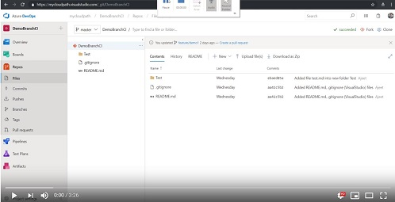

Branch policies helps you to ensure the code quality.

In this post, I will show how we can configure branch policies.
<!--more-->

### Watch demo for more details
 

https://docs.microsoft.com/en-us/azure/devops/repos/git/branch-policies-overview?view=azure-devops         
https://www.perforce.com/blog/vcs/8-tips-effective-branch-management
https://docs.microsoft.com/en-us/azure/devops/repos/git/git-branching-guidance?view=azure-devops