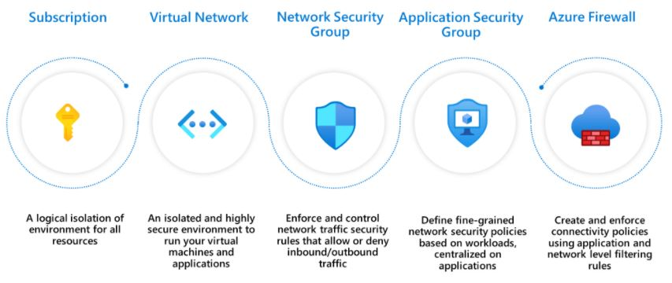

"Moving to the cloud or Journey to the cloud" is the topmost priority of the Enterprise these days. The demand for Cloud adoption is continuously increasing. However, the public cloud SECURITY is one of the biggest concerns for the clients ( How to Secure and govern workloads connectivities). 
In this post, we will discuss various segmentation patters provided by Microsoft to address such concerns.

<!-- more -->

Consider the use case where Enterprise has started its Journey to Cloud by migrating their existing apps to the cloud (as-is) or re-design the apps (if not possible to migrate as-is) as Cloud Native apps. Also, planning to leverage the PaaS services where ever possible. 

> **[Microsoft Cloud Adoption Framework](https://docs.microsoft.com/en-us/azure/cloud-adoption-framework/)** will help you to plan and execute the migration.

The client has asked you to address the following connectivity architecture concerns. 

1. Provide network segmentation with control over the resources connectivity. 
2. Setup secure connectivity between On-prem - Azure without going over the internet.
3. Access to Azure Resources (IaaS and PaaS) from on-prem to Azure or between the VNETs must be private (any communication over the public internet is restricted).

There are various segmentation patterns provided by Microsoft that will help you to address connectivity concerns.

## Network Segmentation Patterns

Segmentation is a model in which you take your networking footprint and create software-defined perimeters using the different tools available as part of Azure's offerings. You then set rules that govern the traffic from/to these perimeters so that you can have different security postures for your network.

### Single VNET pattern

### Multiple VNET pattern

### Hub-spoke pattern

